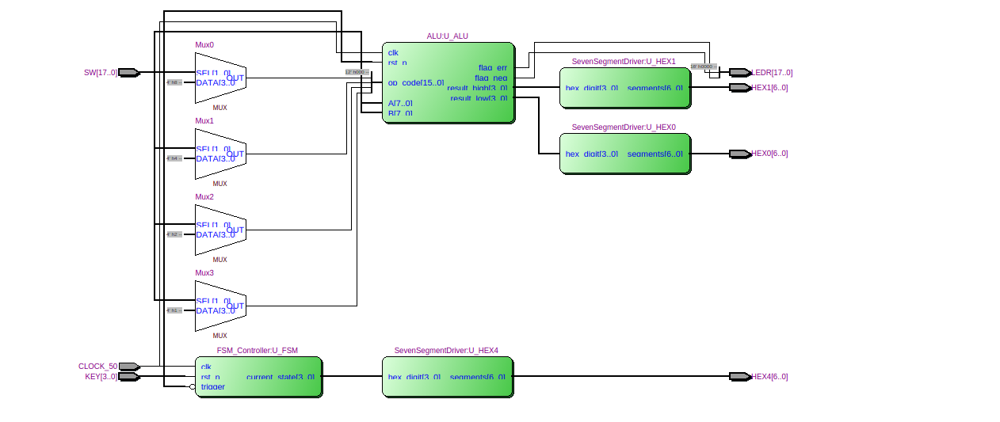
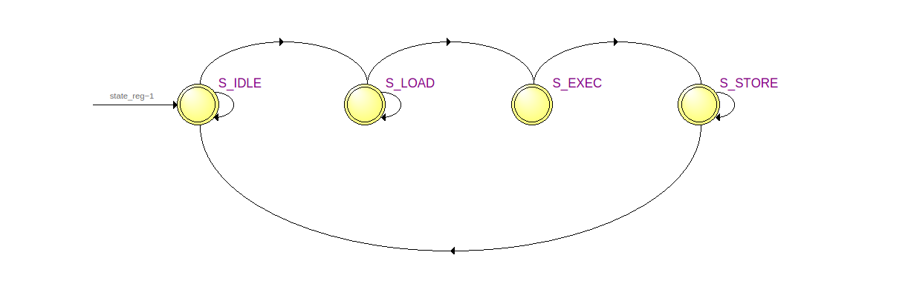
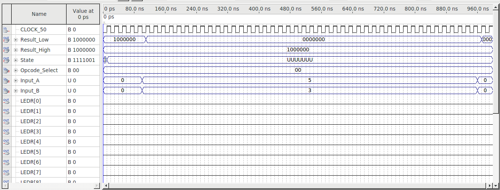
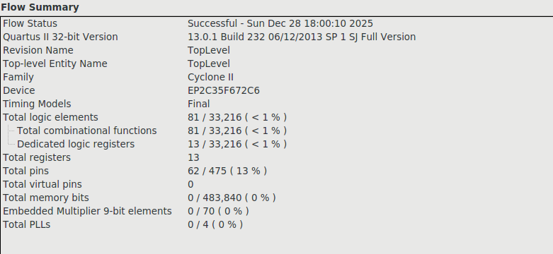

# FPGA 8-bit Datapath & Control Core

A synthesizable **Register Transfer Level (RTL)** system designed for the **Altera Cyclone II** FPGA. This project implements a modular Arithmetic Logic Unit (ALU) decoupled from a Moore Finite State Machine (FSM) controller.

## Architecture
The system follows a hierarchical design pattern, utilizing a `TopLevel` entity to map internal logic to physical board peripherals (Switches, LEDs, Hex Displays).

### RTL Schematic

*Figure 1: High-level RTL view generated by Quartus II, showing the separation of Datapath (ALU) and Control (FSM).*

---

## Components
### 1. Arithmetic Logic Unit (ALU)
* **Width:** 8-bit Vector / 16-bit Opcode
* **Capabilities:** Hardware-level addition, subtraction, and bitwise logic (NAND, NOR, XOR).
* **Flags:** Zero-flag, Negative-flag, and Overflow detection (mapped to LEDR).
* **Engineering:** Implemented using `ieee.numeric_std` for type-safe arithmetic.

### 2. Finite State Machine (FSM)
* **Type:** Moore Machine (Outputs depend solely on current state).
* **States:** `IDLE` → `LOAD` → `EXECUTE` → `STORE`.
* **Visualization:** Quartus State Machine Viewer reverse-engineering:

---

## Verification & Timing

### Waveform Simulation
Functional correctness was verified using ModelSim/Quartus simulation.

*Figure 3: Timing diagram confirming 50MHz synchronous operation.*

### Timing Analysis (TimeQuest)
Constraints applied via `constraints.sdc` to ensure signal stability at 50MHz.
* **Clock:** 50 MHz (20ns period)
* **Setup Slack:** Positive (Timing Met)
* **Hold Slack:** Positive (Timing Met)

### FPGA Resource Usage
Synthesized for **Cyclone II EP2C35F672C6**.
* **Logic Elements:** < 1% (Highly Optimized)
* **Registers:** 34

---

## Reproduction
1.  Open Project in **Quartus II 13.0**.
2.  Set `src/TopLevel.vhd` as Top-Level Entity.
3.  Add `src/constraints.sdc` to the Timing Analyzer.
4.  Compile and Program via JTAG.